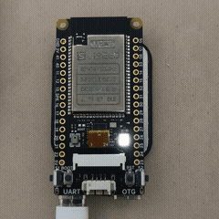
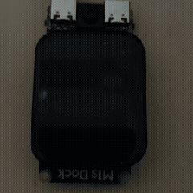

# Bouffalo HAL

**Rust Hardware Abstraction Layer for Bouffalo chips**

## Overview

This repository contains three main components that provide comprehensive support for Bouffalo chips development in Rust:

- **bouffalo-hal**: Hardware Abstraction Layer for Bouffalo IoT chips, providing safe and efficient interfaces to various peripherals. This component abstracts hardware-specific details and offers a consistent API for interacting with the chip's features.

- **bouffalo-rt**: Runtime support for Bouffalo chips, including the `#[entry]` macro and other essential runtime functionalities. This component handles the low-level initialization required before the main application code runs.

- **blri**: A utility for firmware image verification, patching, and flashing assistance. It helps with the firmware burning process for Bouffalo chips.

Together, these components form a complete ecosystem for embedded development on Bouffalo hardware.

## Features

- Rust-native implementation with memory safety guarantees
- Safe and efficient hardware abstractions
- Support for various peripherals: GPIO, UART, SPI, I2C, PWM, and more
- Rich examples demonstrating peripheral usage
- Seamless integration with the embedded Rust ecosystem

## Examples

<table>
  <tr>
    <td align="center" width="32%">
      <a href="examples/peripherals/uart-cli-demo">UART CLI Demo</a>
       
      
    </td>
    <td align="center" width="32%">
      <a href="examples/peripherals/pwm-demo">PWM Demo</a>
       
      
    </td>
    <td align="center" width="32%">
      <a href="examples/peripherals/spi-demo">SPI Demo</a>
       
      
    </td>
  </tr>
</table>

You can find all example code in the `examples/` directory.

## Contributing

Contributions are welcome! 

For bugs or suggestions, please [submit an issue](https://github.com/rustsbi/bouffalo-hal/issues/new).

To contribute code, please follow our [contribution guidelines](https://github.com/rustsbi/slides/blob/main/2025/reports/Contributing%20to%20RustSBI.md). 

## Minimum supported Rust version

To compile the `bouffalo-hal` crates, you need at least stable Rust version of `rustc 1.85.0`.

## License

This project is licensed under either of

- MIT license ([LICENSE-MIT](LICENSE-MIT) or [https://opensource.org/licenses/MIT](https://opensource.org/licenses/MIT))
- Mulan PSL v2 ([LICENSE-MULAN](LICENSE-MULAN) or [https://opensource.org/licenses/MulanPSL-2.0](https://opensource.org/licenses/MulanPSL-2.0))
